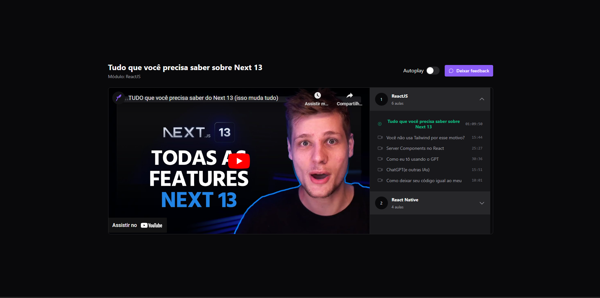

# Redux + Zustand

    

## :computer: Projeto

Este projeto é um video player com módulos e aulas que foi construído em ReactJS, com o objetivo de entender como trabalhar com Redux e Zustand para controle de estado. Também foi aplicado testes unitários com o vitest.

## :rocket: Tecnologias

- [React](https://reactjs.org)
- [Radix ui](radix-ui.com)
- [Redux Toolkit](https://redux-toolkit.js.org)
- [Zustand](https://zustand-demo.pmnd.rs)

## :thinking: Como rodar o projeto?

1. Rodar o comando `npm i` para instalar as dependências

2. Rodar o comando `npm run dev` para rodar o projeto

3. Rodar o comando `npm run server` em outro terminal para rodar o servidor json
